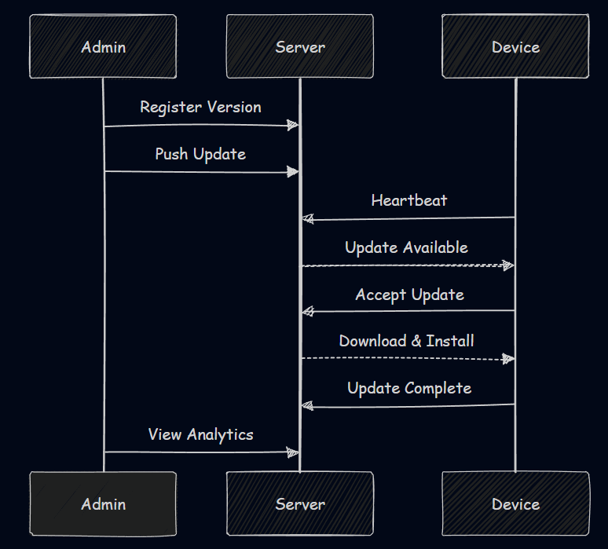

# MoveInSync Assignment

Real-time application update management system with admin dashboard and client synchronization.

## System Architecture

## Tech Stack
- **Language**: JavaScript
- **Frontend**: React + Vite
- **Backend**: Node.js + Express
- **Database**: MongoDB

## Features

### Authentication

### Push Updates

### Version Management

### Analytics Dashboard

### Update Timeline

### Client Interface

