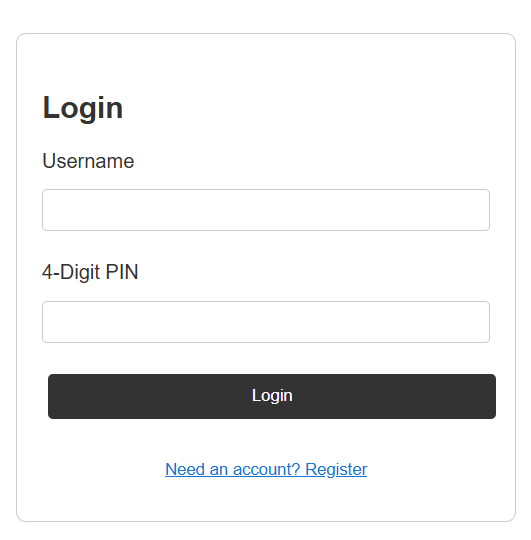
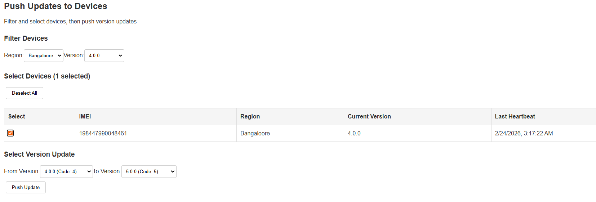
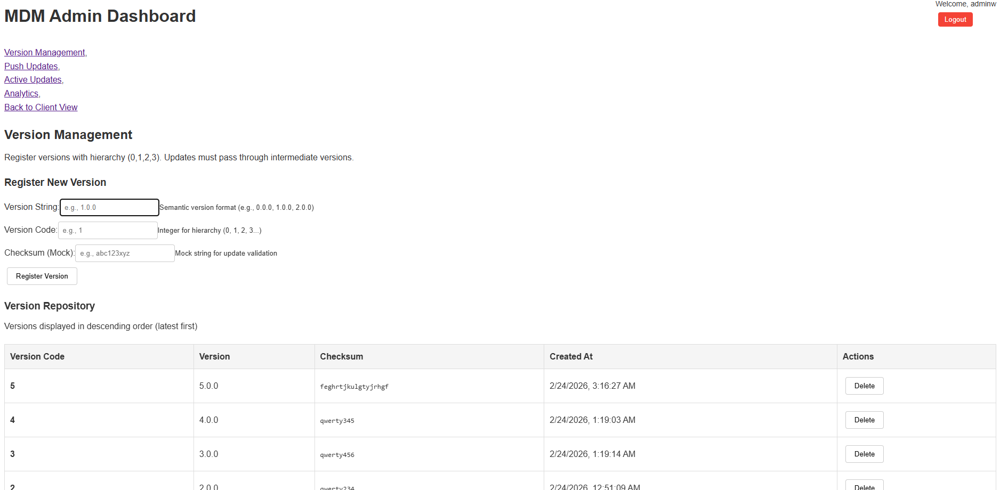
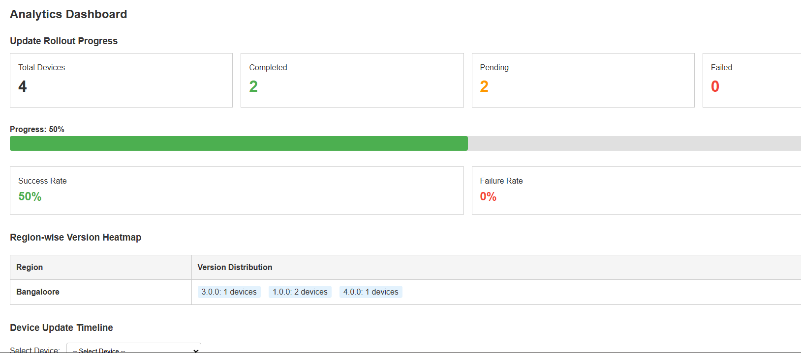
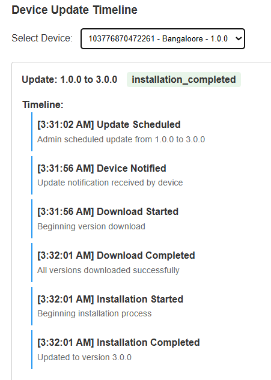
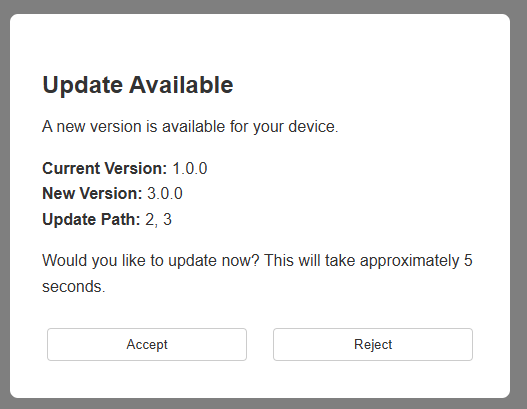
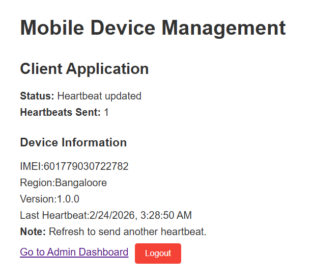
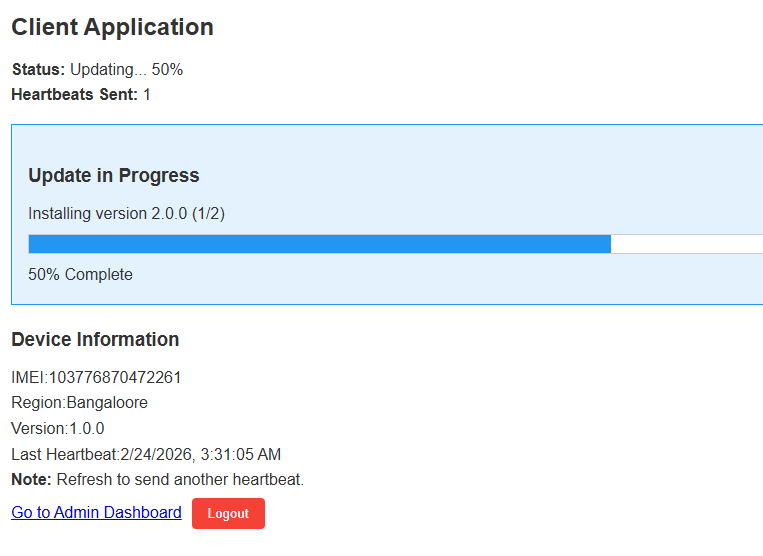

# MoveInSync Assignment

An application update management system with admin dashboard and client sync.

## Features

### Admin Dashboard

*Secure admin authentication*

*Push live updates to connected clients*

*Manage application versions*

*Track update metrics and device statistics*

*View update history and timeline*

### Client Interface

*Web client interface*

*Client update management*

*Client-side update acceptance flow*

## Tech Stack
- **Langauge**: JavaScript
- **Frontend**: React,Vite
- **Backend**: Node.js,Express
- **Database**: MongoDB
