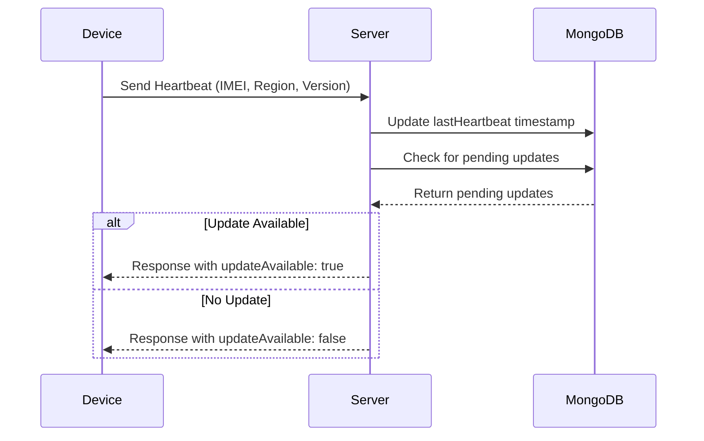
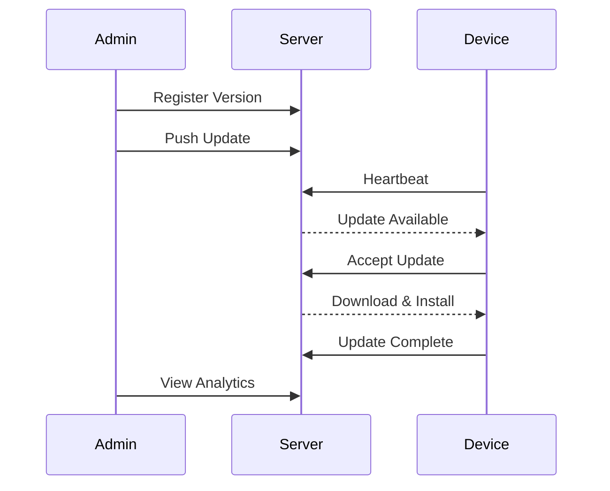
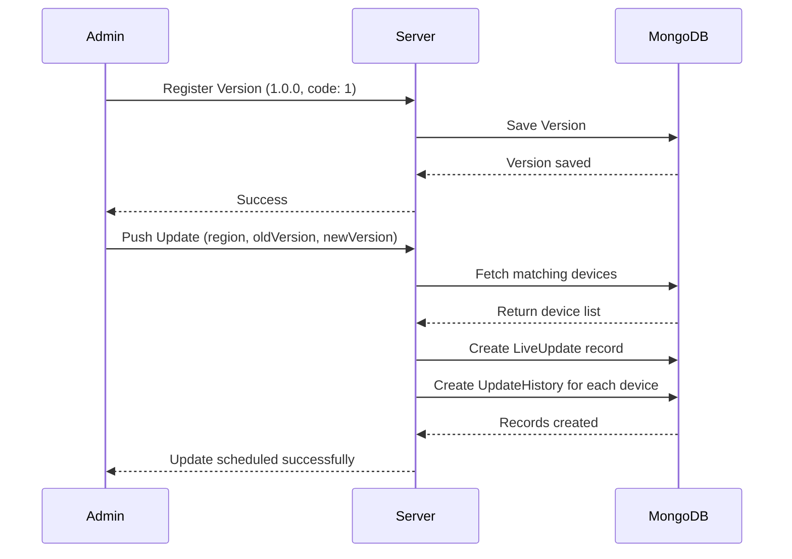
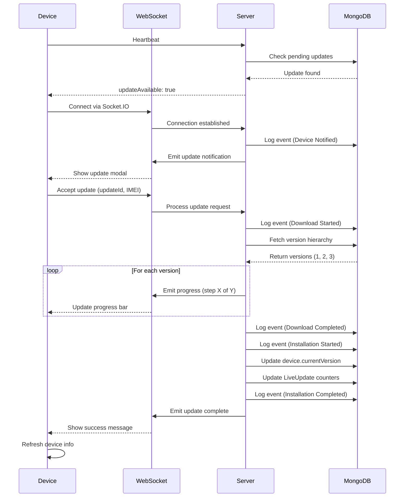
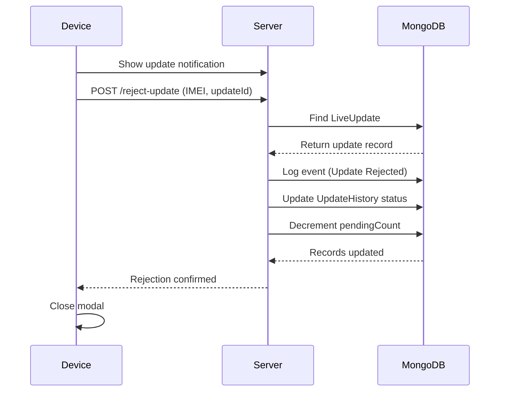
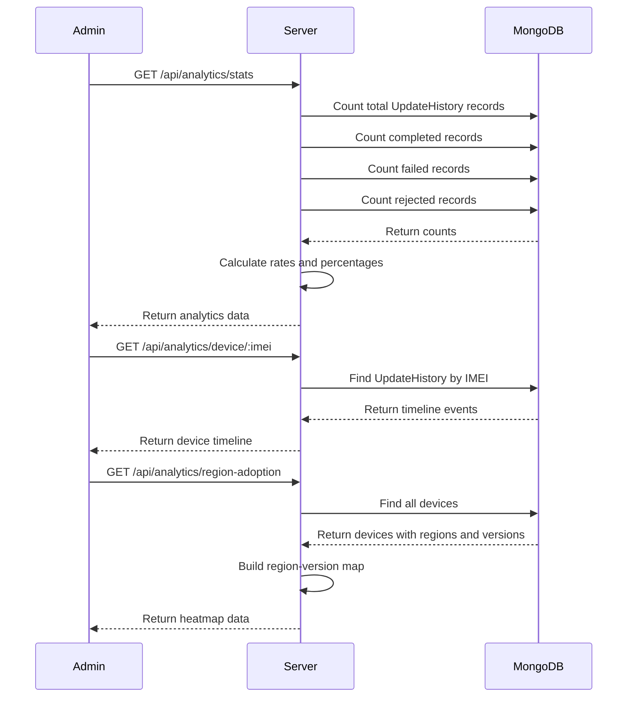
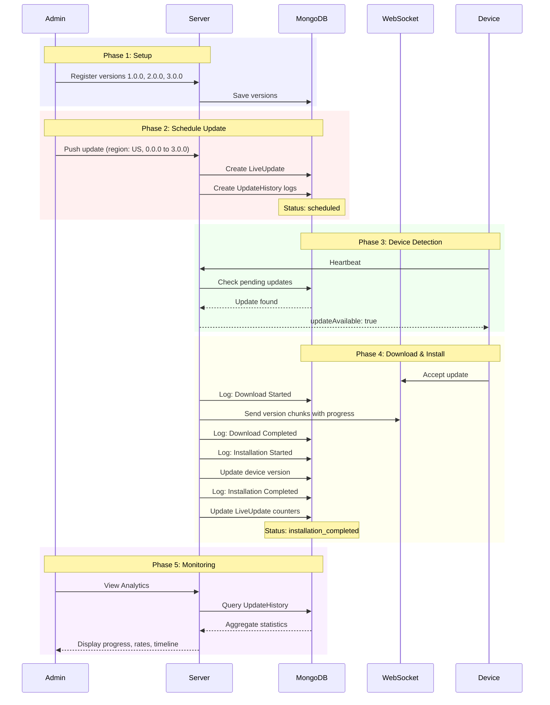

# Sequence Diagrams for MDM System

## Website to Visualize

**Mermaid Live Editor**: https://mermaid.live

Copy any of the diagrams below and paste them into the editor to see the visual diagram.

---

## 1. Device Heartbeat Flow

---

## 2. High-Level Update Flow (Simple)

---

## 3. Admin Creates and Pushes Update (Detailed)

---

## 4. Device Receives and Accepts Update

---

## 5. Device Rejects Update

---

## 6. Analytics Dashboard Query

---

## 7. Complete Update Workflow

---

## How to Use

1. Go to https://mermaid.live
2. Copy any of the diagram codes above
3. Paste into the editor
4. The diagram will render automatically
5. You can download as PNG or SVG

Alternative websites:
- https://mermaid-js.github.io/mermaid-live-editor
- https://mermaid.ink (for quick links)
